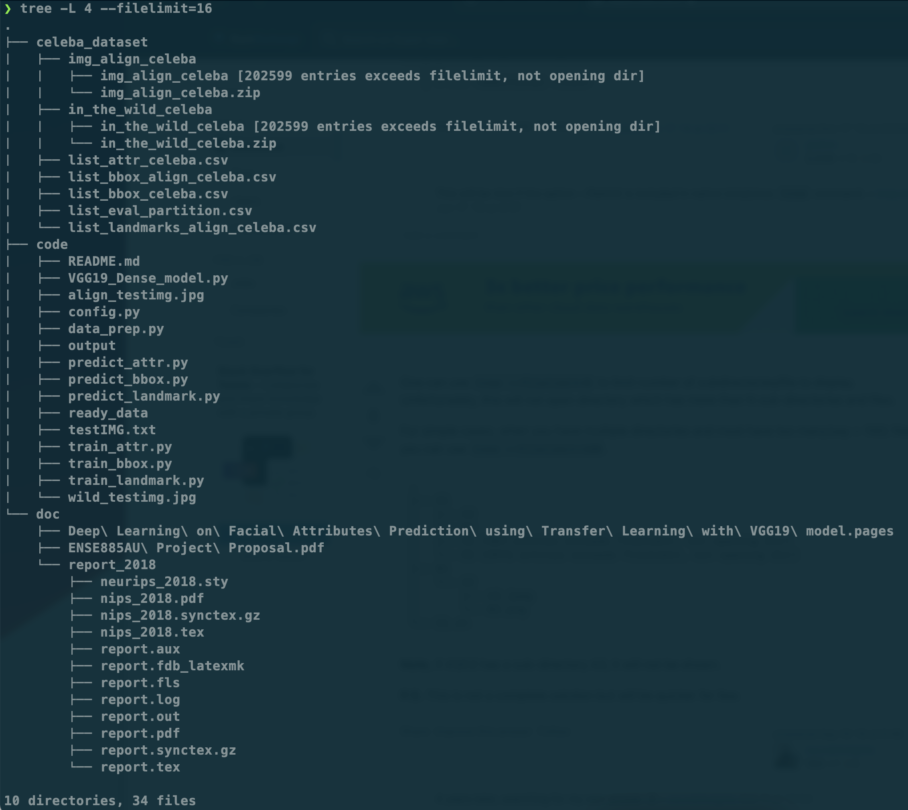

# Deep Learning on Facial Attributes Prediction using Transfer Learning with VGG19 model

## Demo Steps

### Step 0: Environment Demo

Installation of tensorflow on apple M1: [Click_it](https://developer.apple.com/metal/tensorflow-plugin/ "Getting Started with tensorflow-metal PluggableDevice")

```sh
# Activate Conda if applied
source ~/miniforge3/bin/activate

# Show python version, need 3.9+
python -V
    > Python 3.9.7

# Show pip version, need 20.3+
pip -V
    > pip 21.3

# Show tensorflow version
conda list | grep tensorflow-deps
    > tensorflow-deps           2.6.0                         0    apple
```

File structure



### Step 1: File Path Configuration

```sh
# Peek the config file
cat config.py
```

- Includes the file path of 
    - Image Dataset 
    - CSV Dataset
    - Output Directory
    - Prepared Data Directory

- Also defines the 
    - Aligned Image Dimension
    - Target Image Dimension for Training
    - Initialized Learning Rate
    - Maximum Number of Training Epochs
    - Batch Size of the Training Dataset

- Supress the tensorflow warning messages.

- Defines a progress_bar function included from Stackoverflow Open Source Website.

### Step 2: Feature Extraction

To save precious memory, extract and save data in advance.

```sh
# Start Data Preparation
python data_prep.py
```

- Do training, validation, testing partition

- Bounding box normalization and tranformation
    - csv -> ( x_1, y_1, width, height )
    - x_1 = x_1 / img_width
    - y_1 = y_1 / img_height
    - x_2 = ( x_1 + width ) / img_width
    - y_2 = ( y_1 + height ) / img_height
    - return -> (x_1, y_1, x_2, y_2) in float32

- Facial landmarks normalization
    - csv -> ( x, y ) of 5_landmarks
    - x = x / img_width
    - y = y / img_height
    - return -> ( x, y ) of 5_landmarks in float32

- Facial attributes modification
    - csv -> '-1' or '1' indicating the existance of the 40 attributes
    - convert '-1' to '0'
    - return -> '0' or '1' for each attributes

- Save all results to cooresponding .txt files

### Step 3: Build Model

```sh
# Peek the model file
cat VGG19_Dense_model.py
```

- Convert the input image filenames into tf.data.Dataset

- Zip with the cooresponding input targets

- Parse image data to the generated tf.data.Dataset
    - Image normalization by dividing each pixel by 255.0
    - Resize image to target input size, (224, 224, 3)
    - Extand the image dimension due to the requirment of VGG19 model

- Build the model:
    - Create an instance of the VGG19 model,
        - use the 'imagenet' weights
        - set input tensor size to (224, 224, 3)
        - and NOT include the original fully connected layers top
        - diable the training
    - Construct the new fully connected layers,
        - Flatten the output from VGG19 model
        - 7 dense layers with undefined hidden node dimensions and relu activation
        - one last dense output layer with undefined number of output nodes and undefined output activation
    - The convolutional layer of the VGG19 model is reconnected as the input, and the new fully connected layer is the output

- Compile the new model:
    - Optimizer: Adam with initialized learning rate
    - Loss function: undefined
    - metrics: undefined

- Fit the new model:
    - Training dataset
    - Epochs set to the predefined epochs
    - Validation dataset
    - Callbacks
        - Early-Stopping monitoring the validation loss with 3 patience
        - Checkpoint to only save the model with best performance

- Evaluate the new model with generated testing dataset

- Print the model summary

- Plot the loss and accuracy of the model training

### Step 4: Train the model for different problem

```sh
# Training the bounding box model
python train_bbox.py

# Training the facial landmark model
python train_landmark.py

# Training the facial attributes model
python train_attr.py
```

Bounding Box model:
- 512 nodes in each hidden layer
- 4 outputs
- sigmoid output activation
- mean_squared_error loss function
- accuracy metric

Facial Landmarks model:
- 4096 nodes in each hidden layer
- 10 outputs
- sigmoid output activation
- mean_squared_error loss function
- accuracy metric

Facial Attributs model:
- 512 nodes in each hidden layer
- 40 outputs
- sigmoid output activation
- binary_crossentropy loss function
- binary_accuracy metric

### Step 5: Predict Facial Bounding box Coordinates

```sh
# For given input image
python predict_bbox.py -I align_testimg.jpg

# For the giveb name list
python predict_bbox.py -I testIMG.txt

# For the image from the database
python predict_bbox.py -I 000001.jpg
```

### Step 6: Predict Facial Landmarks Coordinates

```sh
# For given input image
python predict_landmark.py -I align_testimg.jpg

# For the giveb name list
python predict_landmark.py -I testIMG.txt

# For the image from the database
python predict_landmark.py -I 000001.jpg
```

### Step 7: Predict Existance of Facial Attributes

```sh
# For given input image
python predict_attr.py -I align_testimg.jpg

# For the giveb name list
python predict_attr.py -I testIMG.txt

# For the image from the database
python predict_attr.py -I 000001.jpg
```
